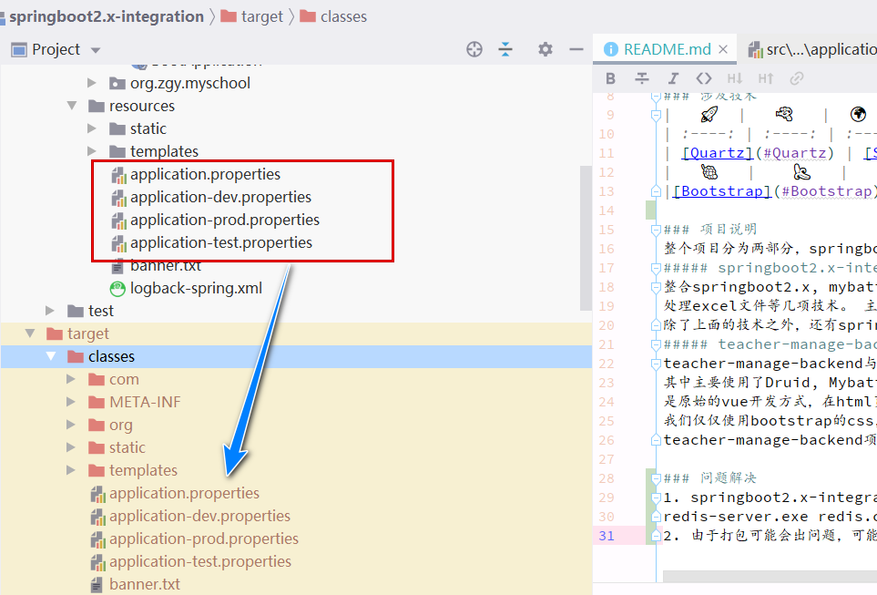

# <font color="#137db1">springboot2.x-integration</font>
    

## <font color="#137db1">涉及技术</font>
| 🍅 |   ⚽   |  🌷  |   🎃   |  🎡  |   ✨   |   📚   |
| :----: | :----: | :----: | :----: | :----: | :----: | :----: |
| [Springboot](#Springboot) | [Mysql](#Mysql) | [Mybatis](#Mybatis) | [MybatisPlus](#MybatisPlus) | [druid](#druid) | [MongoDb](#MongoDb) | [Redis](#Redis) |
| 👕 | 🧸 | 🏹 | ⏰ | 🏀 | ⚾ | 🧣 |
| [maven](#maven) | [file-upload](#file-upload) | [big-file-upload](#file-upload) | [Quartz](#Quartz) | [Swagger](#Swagger) | [Knife4j](#Knife4j) | [thread-pool](#thread-pool) |
|   📐   |  🌍 | 🎯 | 🎱  |   📈   |   🎆  | 🚀 |
|[Kaptcha](#Kaptcha) | [qrcode](#qrcode) | [Shiro](#Shiro) | [springsecurity](#springsecurity) | [springsession](#springsession) | [jwt](#jwt) |[ElasticSearch](#ElasticSearch)|
|📄 | 🎁 | 🔨 | ✨ | 🐋 |  ||
|[logback](#logback) | [Zipkin](#Zipkin) | [hutool](#hutool) | [mail](#mail) | [docker](#docker)  |  ||
|🥨 | 🥯 | 🍇 | 🍝 | 🥣 | 🥫 |🎫|
|[html](#html) | [css](#css) | [Bootstrap](#Bootstrap) | [layui](#layui) | [javascript](#javascript) | [jQuery](#jQuery) |[Vue2](#Vue2)|
|🍌 | 🥡 | 🎠 |  |  |  ||
|[axios](#axios) | [nodejs](#nodejs) | [wangEditor](#wangEditor) |  |  |  ||

## <font color="#137db1">项目说明</font>
**整个项目分为4个部分, 详细情况如下：**

1. springboot2.x-integration是总的一个工程, 他下面的工程, `one-piece`是上述相关技术的整合的一个总的工程, 他是在springboot2.x-integration之中的, springboot2.x-integration使用的是pom打包的方式, 而`one-piece`是他下面的一个子module, clean-env和`one-piece`一样, 都是springboot2.x-integration的子工程, 之间存在父子关系, 这个在springboot2.x-integration的pom.xml文件之中就可以看出, 在clean-env和`one-piece`之中也有体现。clean-env是一个空工程。
2. 各种以sp2-xxx开头的module, 可以单独打包, 与springboot2.x-integration没有父子的隶属关系, 与`one-piece`也没有父子隶属关系, sp2-xxx是一个技术的单独学习和研究的module, 而在`one-piece`之中, 这些技术都被整合了起来, 是一种1对多，单独与整体的关系, 当然这只是在技术整合上, 二者在工程组织上, 没有相互隶属的父子模块关系, sp2-xxx都可以单独打包, sp2-xxx与`one-piece`只是都组织在springboot2.x-integration这个工程的文件夹下面。sp2-xxx的含义是springboot2.x+某一项技术或者是解决方案。
3. teacher-manage-backend与teacher-manage-fronted是一个简单的教师学生管理系统，使用了`vue2`来实现，前端使用的是基本的html控件, 没有使用element或者是bootstrapvue, teacher-manage-backend与springboot2.x-integration二者没有父子模块的关系, teacher-manage-backend是独立的工程, 可以单独打包, teacher-manage-fronted也可以单独打包。
4. web-fronted是一个包含前端工程的文件夹, 其中包括tradition-fronted和vue-frontend-collector, vue-frontend-collector之中的bootstrapvue-demo, 是bootstrapvue的使用demo。tradition-fronted文件夹之中，包含两个部分, 分别是bootstrap-step和layui-step, 前者是bootstrap3.x的学习案例, 后者是layui的学习案例, 都是经典的jquery+html5+css3的传统前端开发方式, 其中主要是各种组件的使用与布局的学习, 主要就是`栅栏系统`, 二者非常相似, 只是有部分的组件不一样而已, 其他方面差别不大, 最重要的区别, 其实就是css配色的不同了, 保留这一部分的原因是因为在springboot的开发之中, 一般需要页面, 那么就要使用thymeleaf模板, 配合这些基础的前端知识, 不至于让这些demo页面太丑。

### <font color="skyblue">one-piece💦</font>
one-piece💦模块是一个整合所涉及技术的模块, 目前整合了富文本编辑器<font color="lightpink">*wangeditor*</font>, <font color="lightpink">*生成二维码*</font>的两种方式, 使用<font color="lightgreen">*hutool*</font>和<font color="lightgreen">*zxing*</font>的两种方式, <font color="lightpink">*生成验证码*</font>的两种方式, 使用<font color="lightgreen">*hutool*</font>和<font color="lightgreen">*kaptcha*</font>的两种方式, 其中<font color="lightgreen">*kaptcha*</font>又有xml配置方式与config配置方式两种, <font color="lightpink">*普通文件上传*</font>, <font color="lightpink">*大文件上传*</font>, <font color="lightpink">*druid*</font>与<font color="lightpink">*mybatis-plus*</font>的整合, <font color="lightpink">*springsession*</font>的实现, 使用jdbc和redis两种方式, <font color="lightpink">*mybatis多数据源的整合*</font>, package分包与动态数据源的两种方式, 以及<font color="lightpink">*jwt*</font>的实现, 此处目前采用的是<font color="lightgreen">*java-jwt*</font>包。
上述的相关技术都整合到了`one-piece💦`之中, 后续会单独挖掘到每一个单独的项目module之中。
每个sp2-xxx项目在各自的module之中, 说明其实现的功能与注意点。

### <font color="#c68c2f">teacher-manage-backend</font>
teacher-manage-backend与springboot2.x-integration没有隶属的关系, teacher-manage-backend是教师管理系统的后台, 作为一个后台系统, 其中主要使用了Druid, Mybatis, MybatisPlus技术, 主要是提供给前台增删改查的CRUD功能。 resources文件夹下的bootvue目录, bootvue目录, 是原始的vue开发方式, 在html页面之中使用vue, 创建vue对象, 然后进行数据和行为的绑定以及控制。使用了bootstrap的ui。在这一部分之中, 我们仅仅使用bootstrap的css, 不使用他的js, js部分功能, 由vue来实现。bootvue目录没有前后分离, 只不过使用了vue技术的html页面。
teacher-manage-backend项目的前端部分, 在该项目下的teacher-manage-front, 基于vue2.x, 启动的时候依次运行`npm install`, `npm run dev`启动。

## <font color="#137db1">问题解决</font>
1. one-piece项目启动, 需要首先启动redis, 否则就会报错, windows下, 命令行下面启动redis-server.exe可能会报错, 需要执行redis-server.exe redis.conf, 如C:\work-soft\Redis-x64-3.2.100>redis-server.exe redis.conf, 后面的redis.conf是配置文件。

2. 由于打包可能会出问题, 可能无法把两个项目之中的配置文件打包到运行其中, 则需要手动拷贝, 也就是target的classes目录下, 如下图: 


3. 打包问题的解决, 添加两个资源包, 一个是打包mapper.xml文件, 一个是打包resources目录下的文件, 这样两个就都能打包target的class或者jar包里了。
    ```xml
    <build>
        <plugins>
            <plugin>
                <groupId>org.springframework.boot</groupId>
                <artifactId>spring-boot-maven-plugin</artifactId>
            </plugin>
        </plugins>
        <resources>
            <!-- mapper下面的xxx.xml文件要打包 -->
            <resource>
                <directory>src/main/java</directory>
                <includes>
                    <include>**/*.xml</include>
                </includes>
            </resource>
            <!-- 包含resources文件夹以及子文件夹下所有资源 -->
            <resource>
                <directory>src/main/resources</directory>
                <includes>
                    <include>**/*.*</include>
                </includes>
            </resource>
        </resources>
    </build>
    ```

4. 页面展示的问题
需要修改`webuploader.css`文件, 配合前端, 就可以将picker和上传按钮放到同一行了, 展示的效果对比如下:<br/>
**页面修改前的样式**

**页面样式修改之后的样式**


5. springboot2.x-integration之中如果需要创建新的module的话, 可以直接在project栏目之中, 选中springboot2.x-integration, 然后右键创建module, 效果如图所示, 但是这样有一点问题, 所以我们在创建module的时候, 不要把新创建的module的位置, 放置在`springboot2.x-integration`所在的文件夹下面, 这样创建出来的module就不会干扰现有的工程和模块。
如下图所示, 把新建的module放在d:\src-repo\demo下面, 和原先的文件夹d:\src-repo\springboot2.x-integration不相关, 这样二者就不会相互影响了。

当我们仍然需要在springboot2.x-integration下面组织module的时候, 只需要把d:\src-repo\demo下面的demo工程, 移动到springboot2.x-integration, d:\src-repo\springboot2.x-integration\demo, 然后再去maven侧边栏加入到maven之中即可,如下显示:
